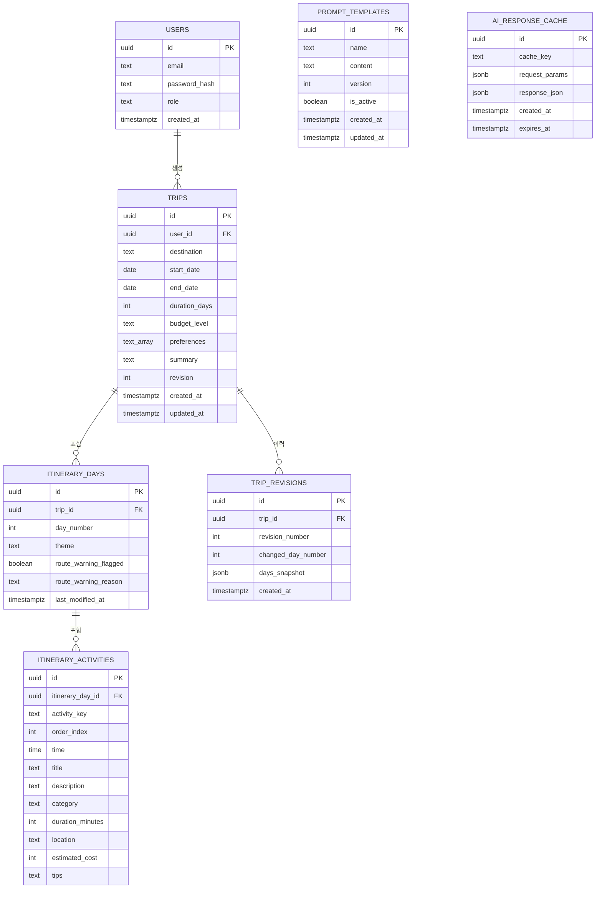

# AI 여행 일정 플래너 — ERD (DB 스키마 설계)

- 작성일: 2026-07-06
- 문서 버전: v1.0
- 기반 문서: PRD_AI여행플래너.md (v2.1)
- 저장소: Supabase(Postgres) 단일 소스 (Redis 등 별도 캐시 계층 없음)

## 1. 설계 원칙
- 관계형 테이블(ERD)로 정규화된 스키마를 구성하고, PK는 uuid(`gen_random_uuid()`)를 기본으로 사용한다.
- 일정의 일자(day)와 활동(activity)은 각각 별도 테이블로 분리해 드래그 재정렬과 일자 단위 부분 재생성을 자연스럽게 지원한다.
- AI 판정 결과(`route_warning`)는 일자(day) 테이블에 컬럼으로 직접 저장해, 사용자 화면 배지와 관리자 모니터링이 같은 원천 데이터를 조회하도록 한다.
- AI 응답 캐시는 별도 인프라 없이 Supabase 테이블(`ai_response_cache`)로 대체한다.
- 인증 토큰(JWT)은 DB에 저장하지 않고 클라이언트 sessionStorage에서 관리한다. 서버는 짧은 만료의 access token만 발급하며, 로그아웃은 클라이언트 측 토큰 삭제로 처리한다(서버 측 강제 무효화 없음 — PRD §15 결정 로그 참고).

## 2. ER 다이어그램

`PROMPT_TEMPLATES`, `AI_RESPONSE_CACHE`는 다른 테이블과 FK 관계 없이 독립적으로 운영된다.

## 3. 테이블 상세

### 3.1 users — 사용자 계정
| 컬럼 | 타입 | 제약 | 설명 |
|---|---|---|---|
| id | uuid | PK, default gen_random_uuid() | 사용자 식별자 |
| email | text | UNIQUE, NOT NULL | 로그인 이메일 |
| password_hash | text | NOT NULL | 해시된 비밀번호 |
| role | text | NOT NULL, CHECK (role IN ('user','admin')), default 'user' | 인가 역할 |
| created_at | timestamptz | NOT NULL, default now() | 가입일시 |

### 3.2 trips — 여행(일정) 기본 정보
| 컬럼 | 타입 | 제약 | 설명 |
|---|---|---|---|
| id | uuid | PK, default gen_random_uuid() | 여행 식별자(API의 trip_id) |
| user_id | uuid | FK → users.id, NOT NULL, ON DELETE CASCADE | 소유 사용자 |
| destination | text | NOT NULL | 목적지 |
| start_date | date | NOT NULL | 시작일 |
| end_date | date | NOT NULL | 종료일 |
| duration_days | int | NOT NULL | 총 일수(생성 시 계산해 저장) |
| budget_level | text | NOT NULL, 최대 30자 | 예산 수준 |
| preferences | text[] | NOT NULL | 취향 다중 선택 값 |
| summary | text | NULL 허용 | AI가 생성한 전체 요약 |
| revision | int | NOT NULL, default 1 | 재조정 반영 횟수 |
| created_at | timestamptz | NOT NULL, default now() | 생성 시각 |
| updated_at | timestamptz | NOT NULL, default now() | 최종 수정 시각 |

### 3.3 itinerary_days — 일자별 일정
| 컬럼 | 타입 | 제약 | 설명 |
|---|---|---|---|
| id | uuid | PK, default gen_random_uuid() | 식별자 |
| trip_id | uuid | FK → trips.id, NOT NULL, ON DELETE CASCADE | 소속 여행 |
| day_number | int | NOT NULL | 며칠차인지(1부터 시작) |
| theme | text | NULL 허용 | 그 날의 테마 |
| route_warning_flagged | boolean | NOT NULL, default false | AI 판정: 동선 이상 여부 |
| route_warning_reason | text | NULL 허용 | 판정 사유(자연어) |
| last_modified_at | timestamptz | NULL 허용 | 이 날짜가 마지막으로 AI에 의해 재계산된 시각(응답의 `last_modified` 플래그 계산에 사용) |

- UNIQUE(trip_id, day_number)로 같은 여행 내 일차 중복 방지.
- 응답 JSON의 `route_warning: { flagged, reason }`은 이 테이블의 두 컬럼을 그대로 매핑.

### 3.4 itinerary_activities — 일자 내 활동(카드)
| 컬럼 | 타입 | 제약 | 설명 |
|---|---|---|---|
| id | uuid | PK, default gen_random_uuid() | 식별자 |
| itinerary_day_id | uuid | FK → itinerary_days.id, NOT NULL, ON DELETE CASCADE | 소속 일자 |
| activity_key | text | NOT NULL | 프론트 표시용 키(예: d1-a1) |
| order_index | int | NOT NULL | 드래그 순서(0부터 시작) |
| time | time | NULL 허용 | 시작 시간 |
| title | text | NOT NULL | 활동명 |
| description | text | NULL 허용 | 설명 |
| category | text | NOT NULL | 카테고리(enum 값은 애플리케이션 레벨에서 고정) |
| duration_minutes | int | NULL 허용 | 소요 시간(분) |
| location | text | NULL 허용 | 위치(구/동 등 지역명) |
| estimated_cost | int | NULL 허용 | 예상 비용 |
| tips | text | NULL 허용 | 참고 팁(동선 이상 시 안내 문구 포함) |

- UNIQUE(itinerary_day_id, order_index)로 같은 날짜 내 순서 중복 방지. 드래그로 순서를 바꾸면 재조정 요청 전 프론트에서 order_index를 재계산해 전달.

### 3.5 trip_revisions — 재조정 이력 스냅샷
| 컬럼 | 타입 | 제약 | 설명 |
|---|---|---|---|
| id | uuid | PK, default gen_random_uuid() | 식별자 |
| trip_id | uuid | FK → trips.id, NOT NULL, ON DELETE CASCADE | 소속 여행 |
| revision_number | int | NOT NULL | 몇 번째 재조정인지(trips.revision과 동기화) |
| changed_day_number | int | NULL 허용 | 이번 재조정에서 변경된 일차(최초 생성 시 NULL) |
| days_snapshot | jsonb | NOT NULL | 재조정 반영 직후 전체 days 배열 스냅샷 |
| created_at | timestamptz | NOT NULL, default now() | 기록 시각 |

- 재조정 시 "다른 날짜는 원본 유지" 검증(§10 에러 처리)을 위해, 직전 스냅샷과 이번 응답을 비교하는 데 사용.

### 3.6 prompt_templates — AI 프롬프트 템플릿 (관리자 관리)
| 컬럼 | 타입 | 제약 | 설명 |
|---|---|---|---|
| id | uuid | PK, default gen_random_uuid() | 식별자 |
| name | text | NOT NULL, UNIQUE | 템플릿 이름(예: initial_generation, reorder) |
| content | text | NOT NULL | 프롬프트 본문 |
| version | int | NOT NULL, default 1 | 버전 |
| is_active | boolean | NOT NULL, default true | 현재 사용 여부 |
| created_at | timestamptz | NOT NULL, default now() | 생성 시각 |
| updated_at | timestamptz | NOT NULL, default now() | 최종 수정 시각 |

### 3.7 ai_response_cache — AI 응답 캐시 (비용 절감)
| 컬럼 | 타입 | 제약 | 설명 |
|---|---|---|---|
| id | uuid | PK, default gen_random_uuid() | 식별자 |
| cache_key | text | UNIQUE, NOT NULL | destination+start_date+end_date+budget_level+preferences 해시값 |
| request_params | jsonb | NOT NULL | 원본 요청 파라미터(디버깅용) |
| response_json | jsonb | NOT NULL | 캐시된 AI 응답(§8.3 스키마) |
| created_at | timestamptz | NOT NULL, default now() | 생성 시각 |
| expires_at | timestamptz | NULL 허용 | 만료 시각(정책 미정, §16 오픈 이슈) |

- 최초 생성 요청에만 적용(재조정 요청은 캐시하지 않음 — PRD §6.8 참고).

## 4. 관계 요약
- users 1 : N trips — 한 사용자가 여러 여행을 저장
- trips 1 : N itinerary_days — 여행 하나에 여러 일자
- itinerary_days 1 : N itinerary_activities — 하루에 여러 활동
- trips 1 : N trip_revisions — 재조정할 때마다 이력 적재
- prompt_templates, ai_response_cache는 FK 없이 독립 테이블

## 5. 인덱스 제안
- trips(user_id) — 사용자별 저장 목록 조회(최신순 정렬은 updated_at 또는 created_at 기준)
- trips(destination) — 관리자 인기 목적지 통계용 GROUP BY 성능
- itinerary_days(trip_id, day_number) — UNIQUE 인덱스 겸용
- itinerary_days(route_warning_flagged) — 관리자 품질 모니터링 목록 필터링
- itinerary_activities(itinerary_day_id, order_index) — UNIQUE 인덱스 겸용
- ai_response_cache(cache_key) — UNIQUE 인덱스(조회 성능)

## 6. 제약사항 및 향후 고려사항
- 동시 편집 충돌은 이번 범위에서 락 없이 마지막 저장이 덮어쓰는 방식(PRD §10, 비목표)이므로 낙관적 락(버전 컬럼 비교) 등은 도입하지 않는다.
- preferences를 text[]로 저장했지만, 취향 종류가 늘어나면 별도 마스터 테이블(정규화)로 분리하는 것을 고려할 수 있다(현재 스코프에서는 과설계로 판단해 제외).
- ai_response_cache의 만료 정책(§16 오픈 이슈)은 구현 단계에서 TTL 배치 또는 조회 시 lazy expiry 중 선택해 확정한다.
- 인증 토큰은 DB 테이블 없이 클라이언트 sessionStorage로만 관리하므로, 서버가 만료 전 토큰을 강제로 무효화할 수단이 없다(짧은 access token 만료시간으로 위험 최소화). 추후 서버 측 강제 로그아웃/토큰 revoke가 필요해지면 별도 테이블 추가를 재검토한다.
